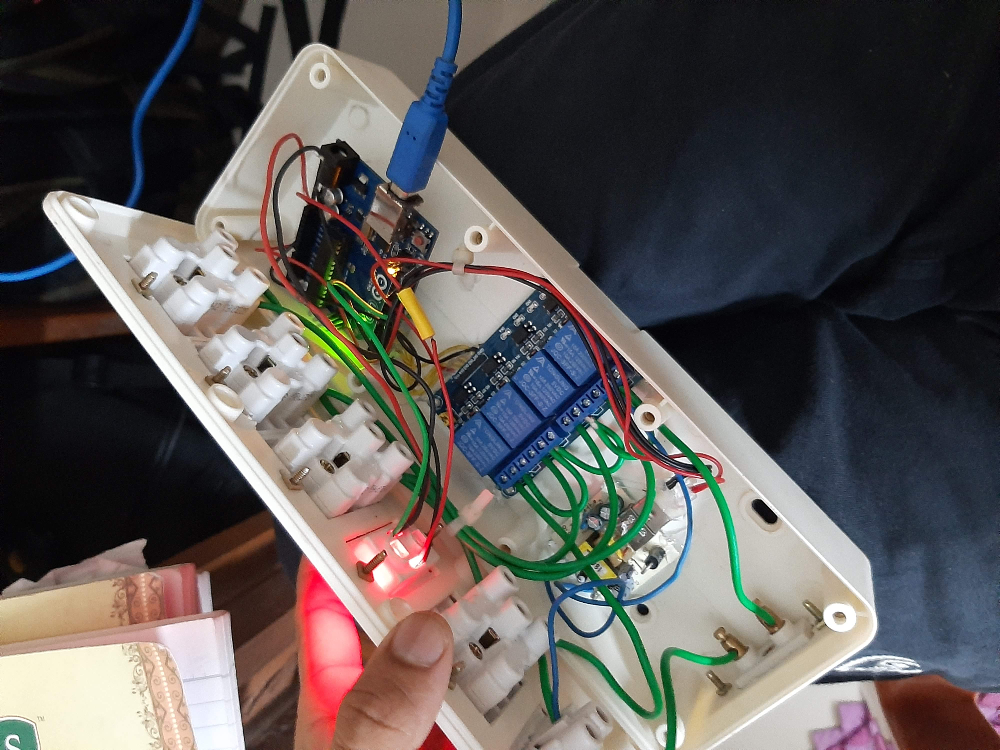

# The_lazy_Code
The source code for Simple-Home-controller using Arduino.

# Smart Home Project
A little classical though, & also made use of whatever i had ! 
`Smart `, Its not exactly the Home is connected to the internet but, uses TV remote which has IR sensor to control the Relay (more like electric switches).  

## A little Back Story
It was covid time, round & round it was close close close. Straight away 1 & 1/2 year in home ! , and was Completely broke. 
 
Anyways the problem was 'The Morning', you know, need fan during night for sound sleep & same time in the morning it would be too cold ! still, the fan is ON. Need a way to turn it OFF without getting up.
 

## Hence,  The Lazy Code !.

- Gathered everything i had, 
    - Arduino UNO
    - IR sensor
    - old TV remote 
    - 4 channel relay module
    - & 3-pin sockets,  switches, indicator, wires, The Case etc.

## Next ?

Here is the video [`link `](https://youtu.be/yADLIZVvrqg)for the complete project. Everything you need. 

## Some Screenshots

| | |
|:---:|:---:|
|||

| | |
|:---:|:---:|
|||

